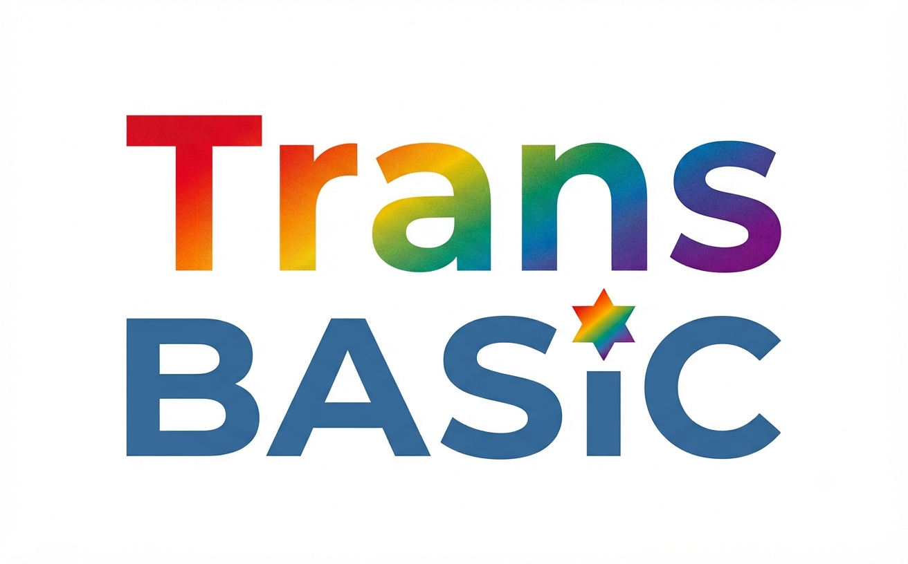

# 🚀 tb - Trans BASIC

---

## 🇪🇸 ESPAÑOL

> *El puente entre las experiencias de BASIC con comandos en lengua materna y la potencia moderna de BBC BASIC for SDL.*

### 🧐 ¿Qué es tb - Trans BASIC?
**tb - Trans BASIC** es un motor ligero, ágil y flexible que te permite programar en BASIC usando las palabras de tu propio idioma.

### 📜 Un poco de historia
Programar en la lengua materna no es una idea nueva. Grandes clásicos de la informática como **ALGOL** (que ya en sus especificaciones oficiales, como ALGOL 68, permitía traducir sus palabras clave a otros idiomas) o lenguajes didácticos como el francés *LSE* y el más moderno *Linotte* exploraron este camino. Sin embargo, la gran mayoría de los proyectos del pasado fueron **dialectos directos de BASIC** o derivados suyos.

Un caso notable es **Logo**, que desde los años 80 se tradujo por completo a decenas de idiomas. Sin embargo, Logo no ofrece la potencia ni la versatilidad multiplataforma de BBC BASIC for SDL, con el que se pueden crear aplicaciones nativas para **Windows, Linux, macOS y Android**. Este proyecto, **tb - Trans BASIC**, nace para ofrecer la capacidad de BBC BASIC for SDL combinada con la posibilidad de programar en tu propio idioma.

### 🙌 Reconocimientos a los pioneros
Este proyecto es posible gracias al trabajo de quienes abrieron el camino:
* **John G. Kemeny y Thomas E. Kurtz:** Creadores del **BASIC** original (1964), por diseñar un lenguaje accesible.
* **Seymour Papert:** Por crear **Logo** y demostrar su gran valor educativo.
* **Sophie Wilson (entonces Roger Wilson):** Por crear el **BBC BASIC** original para Acorn Computers, con su sintaxis limpia y rápida.
* **Richard Russell (R. T. Russell):** Por mantener el **BBC BASIC** durante décadas y adaptarlo a sistemas modernos.
* **Roberto Viola:** Un agradecimiento especial a mi compatriota italiano por su **SdlBasic**, del que he aprendido mucho y que ha sido una gran inspiración.

### 🌱 El origen: De BAS.I.LI.CO a "tb"
El proyecto evolucionó a partir de **BAS.I.LI.CO** (https://github.com/smaxmex/basilico). Comenzó como una adaptación al italiano basada en QB64, y posteriormente se reescribió para apoyarse en el motor de **BBC BASIC for SDL**. 

*Nota sobre el nombre:* El acrónimo BAS.I.LI.CO, que originalmente significaba *BASato sull'Italiano LInguaggio COmpilato*, a partir de ahora significa **BASato sull'Italiano LInguaggio COnvertito**.

El proyecto está vinculado al curso **F.A.C.I.L.E.** (https://corsofacile.blogspot.com). Cabe mencionar que, por el momento, el blog del curso no contiene material específico sobre esta nueva versión de BASILICO en Trans BASIC.

### 🛠️ Guía rápida de uso
1. **Descargar:** Descarga el ZIP desde GitHub y entra en la carpeta `transbasic-linux`. Dentro de la misma encontrarás también los archivos ejecutables `bbcsdl` y `bbcbasic`, que son respectivamente los ejecutables de BBC BASIC for SDL y de la modalidad consola.
2. **Escribir código:** Usa tu editor de texto preferido y guarda el archivo `.bas` (ejemplo: `mi_programa.bas`). Se recomienda usar Geany con el archivo de configuración `filetypes.Azafran.conf`.
3. **Ejecutar desde la terminal:**
   * **Español (Azafran):** `./tb "mi_programa.bas" azafran.txt`

### ⚖️ Licencia
**tb - Trans BASIC** se distribuye bajo la **Licencia zlib**, exactamente igual que *BBC BASIC for SDL*. 

---

## 🇫🇷 FRANÇAIS

> *Le pont entre les expériences du BASIC avec des commandes en langue maternelle et la puissance moderne de BBC BASIC for SDL.*

### 🧐 Qu'est-ce que tb - Trans BASIC ?
**tb - Trans BASIC** est un moteur léger, fluide et flexible qui vous permet de programmer en BASIC en utilisant les mots de votre propre langue. 

### 📜 Un peu d'histoire
La programmation en langue maternelle a une longue histoire, avec des langages historiques comme **ALGOL** ou des langages éducatifs comme le *LSE* français et *Linotte*. Cependant, **Logo** reste un cas marquant pour avoir été traduit intégralement dans de nombreuses langues. Mais Logo n'a ni la puissance ni la polyvalence multiplateforme de BBC BASIC for SDL, qui permet de créer des applications natives pour **Windows, Linux, macOS et Android**. **tb - Trans BASIC** vient combler ce manque en offrant cette puissance dans votre langue.

### 🙌 Remerciements aux pionniers
Ce projet s'appuie sur le travail de ceux qui ont ouvert la voie :
* **John G. Kemeny et Thomas E. Kurtz :** Les créateurs du **BASIC** (1964).
* **Seymour Papert :** L'inventeur de **Logo**.
* **Sophie Wilson :** La créatrice du **BBC BASIC** original pour Acorn Computers.
* **Richard Russell (R. T. Russell) :** Pour avoir maintenu le **BBC BASIC** pendant des décennies sur les systèmes modernes.
* **Roberto Viola :** Un merci particulier à mon compatriote italien pour son **SdlBasic**, qui m'a beaucoup appris et inspiré.

### 🌱 Les origines : De BAS.I.LI.CO à "tb"
Le projet est né de **BAS.I.LI.CO** (https://github.com/smaxmex/basilico). Initialement une adaptation italienne sur QB64, il repose désormais sur le moteur **BBC BASIC for SDL**.

*Note sur le nom :* L'acronyme BAS.I.LI.CO, qui signifiait auparavant *BASato sull'Italiano LInguaggio COmpilato*, signifie désormais **BASato sull'Italiano LInguaggio COnvertito**.

Il est lié au cours **F.A.C.I.L.E.** (https://corsofacile.blogspot.com). À l'heure actuelle, le blog du cours ne contient pas encore de matériel spécifique sur cette nouvelle version de BASILICO via Trans BASIC.

### 🛠️ Guide pratique d'utilisation
1. **Télécharger :** Téléchargez le ZIP et ouvrez le dossier `transbasic-linux`. Vous y trouverez également les fichiers exécutables `bbcsdl` et `bbcbasic`, qui correspondent respectivement aux exécutables de BBC BASIC for SDL et du mode console.
2. **Écrire le code :** Utilisez votre éditeur préféré (ex. Geany avec `filetypes.Persil.conf`). Enregistrez au format `.bas`.
3. **Exécuter depuis le terminal :**
   * **Français (Persil) :** `./tb "mon_programme.bas" persil.txt -c`

### ⚖️ Licence
**tb - Trans BASIC** est distribué sous la **Licence zlib**, tout comme *BBC BASIC for SDL*.

---

## 🇮🇹 ITALIANO

> *Il ponte tra le esperienze del BASIC con comandi in lingua madre e la potenza moderna di BBC BASIC for SDL.*

### 🧐 Cos'è tb - Trans BASIC?
**tb - Trans BASIC** è un motore leggero, veloce e flessibile che permette di programmare in BASIC usando le parole della propria lingua madre. 

### 📜 Un po' di storia
La programmazione in lingua madre ha una storia consolidata, passando da linguaggi come **ALGOL** a linguaggi didattici come *LSE* e *Linotte*, fino al noto **Logo**. Tuttavia, quest'ultimo non possiede la potenza o la flessibilità multipiattaforma di BBC BASIC for SDL (adatto a creare app per **Windows, Linux, macOS, Android**). **tb - Trans BASIC** nasce per unire la potenza di questo motore alla comodità di programmare nella propria lingua, sia per scopi didattici che per lo sviluppo software.

### 🙌 Ringraziamenti ai pionieri
Questo progetto esiste grazie al lavoro di chi ci ha preceduto:
* **John G. Kemeny e Thomas E. Kurtz:** I creatori del **BASIC** originale (1964).
* **Seymour Papert:** Per aver ideato il **Logo** e la sua filosofia educativa.
* **Sophie Wilson:** La creatrice del **BBC BASIC** originale per Acorn Computers.
* **Richard Russell (R. T. Russell):** Per aver mantenuto e aggiornato il **BBC BASIC** nel corso dei decenni per i sistemi moderni.
* **Roberto Viola:** Un ringraziamento speciale al mio connazionale per il suo **SdlBasic**, da cui ho imparato tantissimo e che è stato una grande fonte di ispirazione.

### 🌱 Le origini: Da BAS.I.LI.CO a "tb"
Il progetto deriva da **BAS.I.LI.CO** (https://github.com/smaxmex/basilico). Inizialmente concepito come localizzazione in italiano basata su QB64, è stato successivamente adattato per funzionare con **BBC BASIC for SDL**.

*Nota sul nome:* L'acronimo BAS.I.LI.CO, che inizialmente stava per *BASato sull'Italiano LInguaggio COmpilato*, da ora in poi significa ufficialmente **BASato sull'Italiano LInguaggio COnvertito**.

Il progetto è legato al corso **F.A.C.I.L.E.** (https://corsofacile.blogspot.com). Al momento, il blog del corso non contiene ancora materiale specifico su questa nuova versione di BASILICO basata su Trans BASIC.

### 🛠️ Guida rapida all'uso
1. **Scaricare:** Estrai il file ZIP ed entra nella cartella `transbasic-linux`. All'interno troverai anche i file eseguibili `bbcsdl` e `bbcbasic`, che sono rispettivamente gli eseguibili di BBC BASIC for SDL e della modalità console.
2. **Scrivere il codice:** Usa il tuo editor di testo preferito (si consiglia Geany con il file di configurazione `filetypes.BASILICO.conf`). Salva il file con estensione `.bas`.
3. **Eseguire da terminale:**
   * **Italiano (predefinito):** `./tb "mio_programma.bas"`

### ⚖️ Licenza
**tb - Trans BASIC** è rilasciato sotto **Licenza zlib**, esattamente come *BBC BASIC for SDL*.

---

## 🇬🇧 ENGLISH

> *The bridge between BASIC experiences with native-language commands and the modern power of BBC BASIC for SDL.*

### 🧐 What is tb - Trans BASIC?
**tb - Trans BASIC** is a lightweight, fast, and flexible engine that allows you to program in BASIC using keywords in your native language.

### 📜 A Bit of History
Native-language programming has a solid history, from languages like **ALGOL** to educational tools like *LSE*, *Linotte*, and the widely known **Logo**. However, Logo lacks the cross-platform power of BBC BASIC for SDL, which allows for the creation of native applications for **Windows, Linux, macOS, and Android**. **tb - Trans BASIC** provides this modern power while allowing users to write code in their own language.

### 🙌 Acknowledgments to the Pioneers
This project builds upon the work of those who paved the way:
* **John G. Kemeny and Thomas E. Kurtz:** The creators of the original **BASIC** (1964).
* **Seymour Papert:** For creating **Logo** and highlighting its educational value.
* **Sophie Wilson:** The creator of the original **BBC BASIC** for Acorn Computers.
* **Richard Russell (R. T. Russell):** For maintaining and porting **BBC BASIC** to modern systems over the decades.
* **Roberto Viola:** A special thanks to my fellow Italian for his **SdlBasic**, which taught me a great deal and served as a strong inspiration.

### 🌱 Origins: From BAS.I.LI.CO to "tb"
The project originated from **BAS.I.LI.CO** (https://github.com/smaxmex/basilico). Initially designed as an Italian localization built on QB64, it has been transitioned to utilize the **BBC BASIC for SDL** engine.

*Note on the name:* The acronym BAS.I.LI.CO, which previously stood for *BASato sull'Italiano LInguaggio COmpilato*, now officially stands for **BASato sull'Italiano LInguaggio COnvertito**.

It is associated with the **F.A.C.I.L.E.** programming course (https://corsofacile.blogspot.com). Currently, the course blog does not yet contain specific material on this new Trans BASIC version of BASILICO.

### 🛠️ Quick Start Guide
1. **Download:** Extract the ZIP file and open the `transbasic-linux` folder. Inside, you will also find the executable files `bbcsdl` and `bbcbasic`, which are respectively the executables for BBC BASIC for SDL and console mode.
2. **Write Code:** Use your preferred text editor (Geany with the provided config files is recommended). Save the file with a `.bas` extension.
3. **Run from the Terminal:**
   * **Italian / Default:** `./tb "my_program.bas"`
   * *(See other language sections for Spanish/French commands).*

### ⚖️ License
**tb - Trans BASIC** is released under the **zlib License**, exactly like *BBC BASIC for SDL*.
